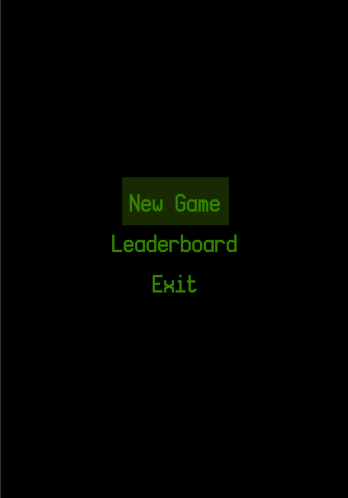
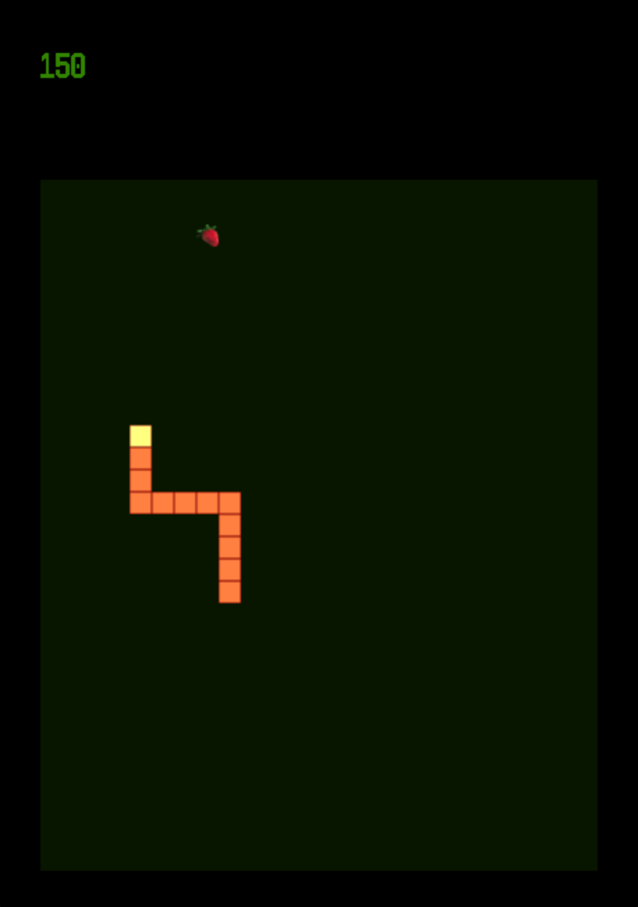
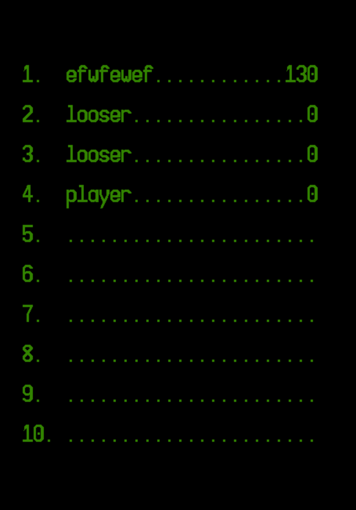

# Snake
___
​
### Description:
    Ucode project: snake - simple videogame.
### Developers:
 [Maxim Libovych](https://github.com/mlibovych)

 [Yulia Bondarenko](https://github.com/kali-y23)

​
### Screenshot:
 
 
 
​
#### 1.Built with
​
 [CMake](https://cmake.org)
​
#### 2.GUI library
​
 [SDL](https://www.libsdl.org/)

### Installation:
    1. git clone https://github.com/mlibovych/snake
    2. cmake . -Bbuild -Wdev -Werror=dev && cmake --build ./build

### How to use?
    ./race00 [width] [height]

### License
[MIT](https://choosealicense.com/licenses/mit/)

---